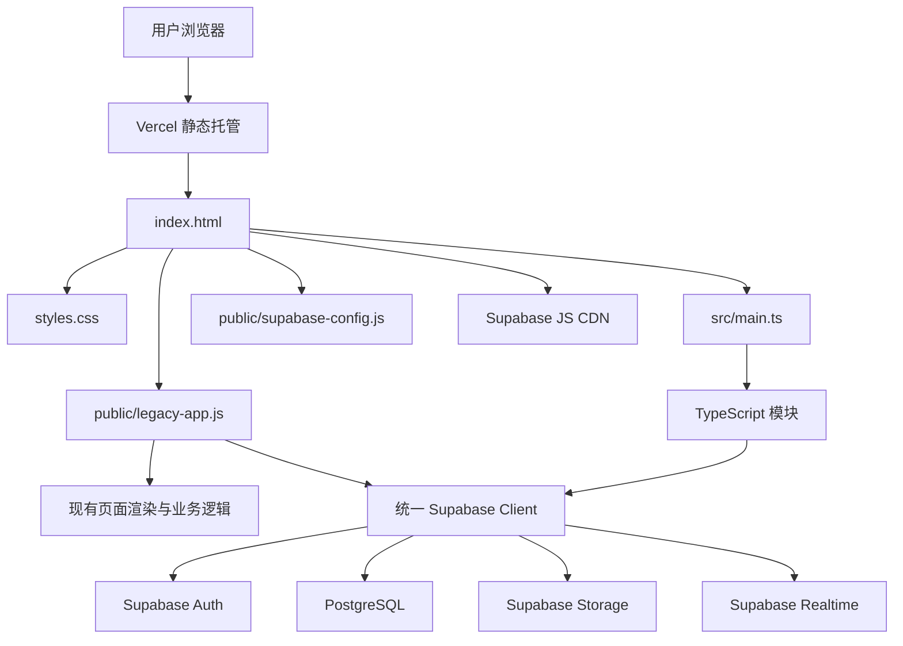
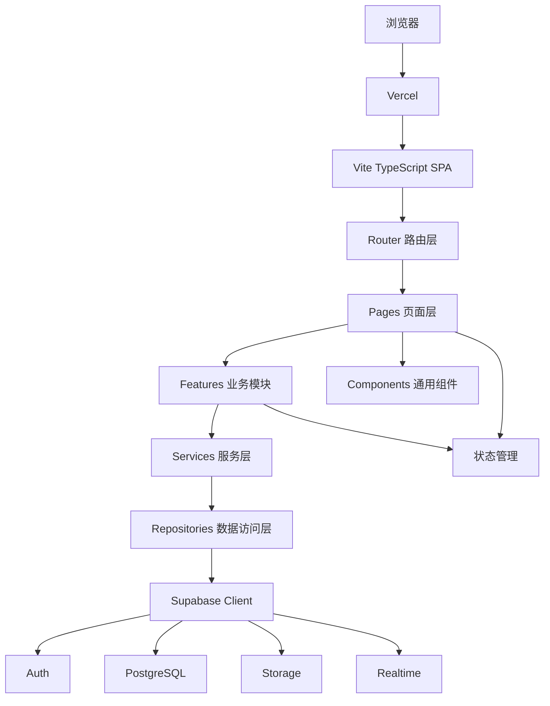
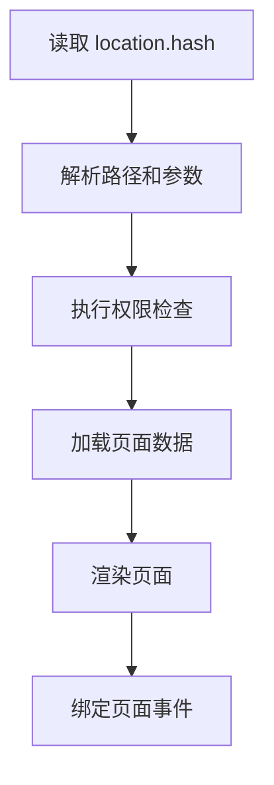
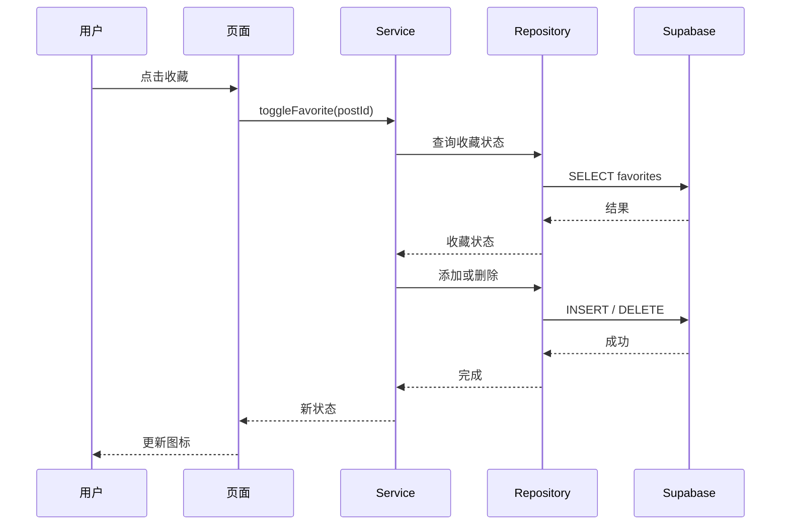
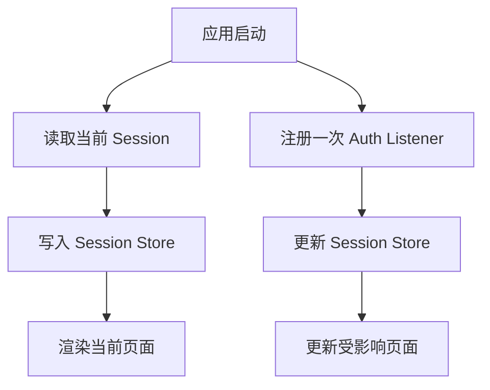
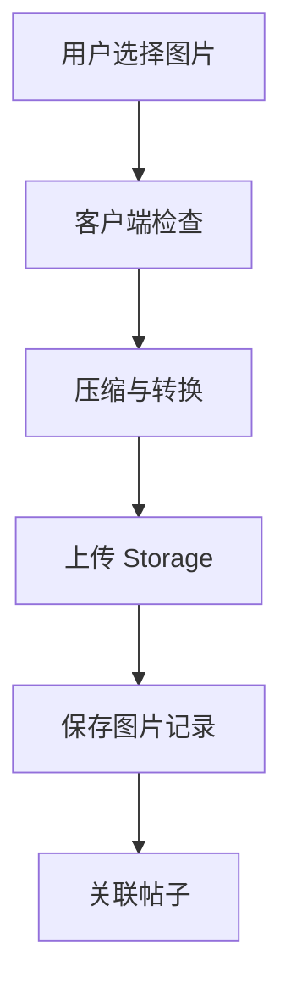
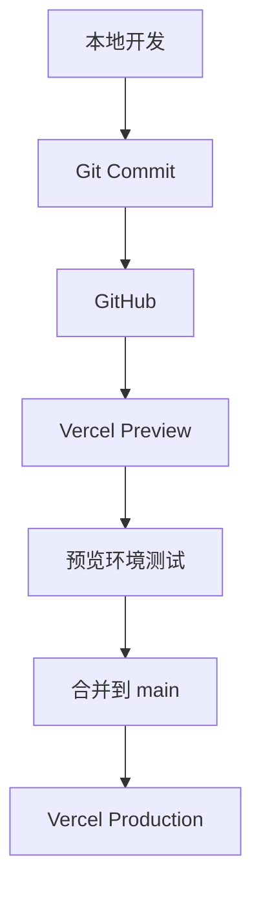

# Saminest 系统架构设计

- 文档版本：1.0
- 产品版本：MVP / V1
- 更新时间：2026-07
- 适用项目：Saminest
- 当前技术栈：Vite、TypeScript、Vanilla JavaScript、Supabase、Vercel
- 文档状态：生效

---

## 1. 文档目的

本文档用于定义 Saminest 的系统架构、模块边界、代码依赖规则、数据访问方式和长期演进方向。

本文档主要解决以下问题：

1. 当前系统由哪些部分组成。
2. 页面、业务逻辑和数据库代码应分别放在哪里。
3. 新功能应如何接入现有项目。
4. 如何逐步迁移现有 `legacy-app.js`。
5. 如何避免项目随着功能增加变成难以维护的单体代码。
6. 如何为未来扩展招聘、服务、活动、商家等分类保留能力。
7. 什么时候需要升级后端架构，而不是过早重构。

---

## 2. 架构目标

Saminest 当前是一个由独立开发者维护的早期产品。

因此，当前架构应优先满足：

- 简单
- 稳定
- 容易理解
- 容易测试
- 容易部署
- 容易逐步迁移
- 不过度设计
- 支持未来扩展

当前阶段不追求一次性设计成大型互联网平台，而是建立清晰边界，使系统能够持续演进。

---

## 3. 产品范围

Saminest 当前面向 DMV 华语社区，核心业务包括：

- 租房
- 求租
- 二手
- 用户认证
- 信息发布
- 图片上传
- 收藏
- 站内消息
- 举报
- 内容审核

现有页面入口包括：

- 首页
- 分类
- 发布
- 消息
- 我的

桌面端还提供：

- 首页
- 租房
- 求租
- 二手

当前网站使用 Hash 路由，并同时加载 TypeScript 入口和旧版业务脚本。

---

## 4. 当前系统架构

### 4.1 当前整体结构



### 4.2 当前架构说明

目前系统处于迁移阶段：

- `index.html` 是应用外壳。
- `styles.css` 提供全局页面样式。
- `src/main.ts` 是新的 TypeScript 应用入口。
- `public/legacy-app.js` 仍承载主要业务功能。
- `supabase-config.js` 提供 Supabase 配置信息。
- Supabase 提供认证、数据库和文件存储。
- Vercel 负责静态网站部署。
- 前端通过 Hash 路由切换页面。

当前阶段允许新旧架构共存，但不允许继续无限扩大 `legacy-app.js`。

---

## 5. 目标架构

### 5.1 MVP 目标架构



### 5.2 长期目标

长期系统应逐步形成以下边界：

```text
页面展示
    ↓
业务模块
    ↓
业务服务
    ↓
数据访问
    ↓
Supabase / 后端 API
```

页面不应直接执行复杂数据库查询。

数据库访问细节不应散落在页面事件处理代码中。

---

## 6. 技术选型

### 6.1 Vite

Vite 作为前端开发和构建工具。

选择原因：

- 启动速度快
- 配置相对简单
- 支持 TypeScript
- 构建结果适合静态部署
- 适合当前独立开发阶段
- 后续可继续接入 React 或 Vue

当前不需要因为产品规模目标而更换构建工具。

### 6.2 TypeScript

TypeScript 作为新代码的默认开发语言。

主要作用：

- 提前发现类型错误
- 明确函数输入和输出
- 降低重构风险
- 让 AI 更容易理解代码
- 减少字段名称和数据结构错误
- 为未来团队协作提供统一约束

规则：

- 所有新增业务模块优先使用 TypeScript。
- 不在新的 TypeScript 文件中使用隐式 `any`。
- 从 Supabase 返回的数据应有明确类型。
- 旧 JavaScript 代码通过渐进式迁移处理。

### 6.3 Vanilla TypeScript

当前阶段继续使用 Vanilla TypeScript，不立即强制迁移 React 或 Vue。

原因：

- 现有产品已经运行。
- 当前主要问题是模块边界，而不是框架不足。
- 立即更换 UI 框架会增加重写成本和风险。
- 产品需求尚未完全验证。
- 独立开发者更需要控制复杂度。

当出现以下情况时，再评估 React、Vue 或其他 UI 框架：

- 页面组件大量重复。
- 局部状态同步越来越困难。
- 页面交互复杂度明显提升。
- 多人协作需要更成熟的组件生态。
- 自动化 UI 测试受到当前结构限制。
- 迁移收益高于重写成本。

框架迁移必须通过架构决策记录批准，不得因为“更流行”而迁移。

### 6.4 Supabase

Supabase 当前承担：

- 用户认证
- PostgreSQL 数据库
- Row Level Security
- 图片文件存储
- Realtime
- Edge Functions，必要时使用

选择原因：

- 适合 MVP 快速开发
- PostgreSQL 可扩展性较好
- RLS 能提供数据库层权限保护
- Auth、Storage 和数据库集成方便
- 当前不需要维护独立后端服务器

Supabase 不是页面业务逻辑的替代品。

必须通过统一的数据访问层使用 Supabase，避免所有页面直接调用 SDK。

### 6.5 Vercel

Vercel 当前负责：

- 静态前端部署
- 预览部署
- 正式环境发布
- HTTPS
- CDN 分发

Vercel 不负责核心数据库权限。

所有数据安全规则必须由 Supabase Auth、RLS、Storage Policy 或受信任的服务端函数保证。

---

## 7. 推荐项目目录

目标目录：

```text
saminest/
├── docs/
│   ├── README.md
│   ├── 01_Product/
│   │   └── PRD.md
│   ├── 02_SystemDesign/
│   │   └── Architecture.md
│   ├── 03_Database/
│   │   └── Tables.md
│   └── 04_Development/
│       └── AI-Development.md
│
├── public/
│   ├── legacy-app.js
│   ├── supabase-config.js
│   ├── robots.txt
│   ├── sitemap.xml
│   └── static-assets/
│
├── src/
│   ├── main.ts
│   ├── app/
│   ├── router/
│   ├── pages/
│   ├── features/
│   ├── components/
│   ├── services/
│   ├── repositories/
│   ├── integrations/
│   ├── state/
│   ├── types/
│   ├── utils/
│   └── styles/
│
├── tests/
├── supabase/
│   ├── migrations/
│   ├── functions/
│   └── seed.sql
│
├── index.html
├── package.json
├── tsconfig.json
├── vite.config.ts
└── README.md
```

当前不要求一次创建所有目录。

目录应在对应模块开始迁移或开发时逐步建立。

---

## 8. 模块职责

### 8.1 `src/main.ts`

只负责应用启动。

允许：

- 初始化应用
- 注册路由
- 注册全局错误处理
- 初始化 Supabase
- 启动认证监听
- 挂载应用

禁止：

- 写完整页面 HTML
- 直接查询帖子列表
- 写收藏逻辑
- 写消息逻辑
- 放大量事件监听
- 存放业务常量

示例：

```ts
import { bootstrapApplication } from './app/bootstrap';

bootstrapApplication().catch((error: unknown) => {
  console.error('Failed to bootstrap application', error);
});
```

### 8.2 `app/`

负责应用级初始化和全局配置。

适合放置：

- 应用启动
- 运行环境
- 全局状态
- 全局错误处理
- 应用级依赖组合

不应放置：

- 某个具体页面的 DOM 模板
- 某个业务模块的数据库查询

### 8.3 `router/`

负责：

- 路由解析
- 路由跳转
- 参数读取
- 登录权限守卫
- 404 页面处理
- 浏览器历史记录处理

路由层不负责：

- 查询帖子
- 上传图片
- 执行业务规则

推荐路由：

```text
#home
#category/rent
#category/wanted
#category/used
#post/:id
#publish
#messages
#me
#login
#register
#forgot-password
#reset-password
```

长期迁移到 History API 时，应保持业务层不受影响。

### 8.4 `pages/`

页面层负责组合组件和调用业务模块。

页面可以：

- 读取路由参数
- 调用 Feature 或 Service
- 控制页面级加载状态
- 渲染页面结构
- 响应页面交互

页面不应：

- 直接拼写复杂 Supabase 查询
- 包含数据库权限规则
- 重复实现通用格式化逻辑
- 访问其他页面内部实现
- 创建新的 Supabase Client

### 8.5 `features/`

`features` 是按照用户能力划分的业务模块。

例如：

```text
features/posts
features/favorites
features/messages
features/reports
```

每个 Feature 可以包含：

```text
features/posts/
├── post-controller.ts
├── post-model.ts
├── post-view.ts
├── post-validation.ts
└── index.ts
```

Feature 负责：

- 用户业务流程
- 业务状态
- 业务验证
- 调用服务层
- 页面相关业务行为

Feature 不应直接创建 Supabase Client。

### 8.6 `components/`

负责可复用的 UI 组件。

例如：

- 按钮
- 输入框
- 帖子卡片
- 标签
- 弹窗
- 空状态
- 加载状态
- 顶部导航
- 底部导航
- Toast

组件原则：

- 一个组件只承担清晰的 UI 职责。
- 组件不直接操作数据库。
- 组件通过参数接收数据。
- 组件通过回调或事件暴露操作。
- 不在组件内部复制业务规则。

### 8.7 `services/`

服务层负责业务用例。

例如：

```text
publishPost()
updatePost()
archivePost()
toggleFavorite()
submitReport()
sendMessage()
```

服务层可以：

- 调用一个或多个 Repository
- 执行业务验证
- 转换数据格式
- 统一处理业务错误
- 编排上传和数据库写入流程

服务层不应该：

- 直接渲染 HTML
- 操作页面 DOM
- 依赖具体按钮或表单元素

### 8.8 `repositories/`

Repository 是数据访问边界。

职责：

- 封装 Supabase 查询
- 隐藏表名和字段细节
- 返回明确类型
- 转换数据库错误
- 提供稳定的数据访问接口

示例：

```ts
export interface PostRepository {
  getApprovedPosts(input: GetPostsInput): Promise<Post[]>;
  getPostById(id: string): Promise<Post | null>;
  createPost(input: CreatePostInput): Promise<Post>;
  updatePost(id: string, input: UpdatePostInput): Promise<Post>;
}
```

页面不应知道数据库查询使用：

- `.from()`
- `.select()`
- `.insert()`
- `.update()`
- `.delete()`

这些细节应集中在 Repository 或专门的数据访问模块中。

### 8.9 `integrations/supabase/`

负责 Supabase SDK 集成。

必须满足：

- 全局只创建一个浏览器 Supabase Client。
- Auth listener 只注册一次。
- Supabase ready/error 事件只统一处理一次。
- 业务模块从统一入口取得 Client。
- 不允许页面自行调用 `createClient()`。

推荐接口：

```ts
export function getSupabaseClient(): SupabaseClient;
```

禁止：

```ts
const client = createClient(url, key);
```

出现在多个业务文件中。

### 8.10 `state/`

只存放确实需要跨页面共享的状态。

可以包括：

- 当前用户
- 当前 Session
- 页面加载状态
- 搜索筛选条件
- 未读消息数量
- 临时 UI 状态

不建议将所有服务器数据复制到全局状态。

服务器数据应优先按需查询，并明确缓存失效规则。

### 8.11 `types/`

集中存放跨模块复用的类型。

示例：

```ts
export type PostStatus =
  | 'draft'
  | 'pending'
  | 'approved'
  | 'rejected'
  | 'archived'
  | 'deleted';

export type PostCategory = 'rent' | 'wanted' | 'used';
```

数据库类型和业务类型可以分开。

不应让数据库字段结构完全控制页面模型。

### 8.12 `utils/`

只放纯工具函数。

适合：

- 日期格式化
- 金额格式化
- 字符串处理
- URL 处理
- 基础验证
- 数组处理

不适合：

- 发布帖子
- 登录
- 收藏
- 数据库查询
- DOM 渲染

当一个工具函数开始依赖业务表、用户状态或 Supabase 时，它通常不再是 `utils`。

---

## 9. 依赖方向

所有模块必须遵守单向依赖。

推荐：

```text
Pages
  ↓
Features / Components
  ↓
Services
  ↓
Repositories
  ↓
Integrations
```

允许：

```text
Pages → Components
Pages → Features
Features → Services
Services → Repositories
Repositories → Supabase Integration
所有模块 → Types / Utils
```

禁止：

```text
Repositories → Pages
Services → DOM
Utils → Supabase
Components → Database
Supabase Integration → Feature
```

禁止循环依赖。

---

## 10. 页面渲染架构

当前可以继续使用 DOM 字符串模板和事件绑定，但必须逐步模块化。

推荐：

```ts
export function renderPostCard(post: Post): string {
  return `
    <article class="post-card" data-post-id="${post.id}">
      ...
    </article>
  `;
}
```

业务事件应集中注册，避免同一个页面每次渲染都重复添加监听器。

推荐采用：

- 页面级事件委托
- 单一初始化入口
- 页面销毁机制
- 明确的 listener 生命周期

禁止：

- 每次 `render()` 都新增全局 listener。
- 同一个功能同时存在多个点击监听器。
- 在多个模块重复监听 Auth 状态。
- 用内联 `onclick` 承载复杂业务。

---

## 11. 路由架构

当前阶段继续使用 Hash Router。

原因：

- 静态部署简单
- 不依赖服务器重写
- 与现有 URL 兼容
- 迁移风险较低

路由解析流程：



路由需要支持：

- 未识别路径
- 登录保护页面
- 重置密码回调
- 详情页面参数
- 返回导航
- 页面标题更新
- 加载和错误状态

路由不得直接包含业务查询实现。

---

## 12. 数据访问架构

推荐的数据流：



数据访问规则：

1. 页面不直接决定表级权限。
2. 所有敏感操作必须由 RLS 或服务端验证。
3. Repository 返回业务可理解的错误。
4. 查询必须只获取需要的字段。
5. 列表必须支持分页。
6. 避免无条件获取全部帖子。
7. 避免一个页面发出大量重复查询。
8. 写操作应防止重复提交。

---

## 13. 认证架构

认证由 Supabase Auth 提供。

认证流程：



必须保证：

- Supabase Client 只有一个。
- Auth listener 只有一个。
- 登录状态由统一 Store 保存。
- 页面通过统一方法获取用户。
- 用户身份变化时统一通知页面。
- Session 恢复完成前显示加载状态。
- 不能仅依靠前端隐藏按钮实现权限控制。

认证功能包括：

- 注册
- 邮箱验证
- 登录
- 登出
- 忘记密码
- 重置密码
- Session 恢复
- 登录过期处理

---

## 14. 权限架构

权限必须分为两层。

### 14.1 前端体验控制

用于：

- 隐藏无权限按钮
- 跳转登录页面
- 显示提示
- 防止明显错误操作

前端权限不是安全边界。

### 14.2 数据库和服务端权限

由以下机制保证：

- Supabase RLS
- Storage Policy
- Edge Function 鉴权
- 管理员角色验证
- 数据所有权验证

角色建议：

```text
guest
user
moderator
admin
super_admin
```

当前 MVP 主要使用：

```text
guest
user
admin
```

未来新增角色时不得依赖硬编码邮箱。

---

## 15. 图片上传架构

图片上传流程：



客户端检查：

- 文件类型
- 文件大小
- 图片数量
- 图片尺寸
- 空文件
- 重复文件

Storage 规则：

- 用户只能上传到自己的路径。
- 文件名使用生成的唯一 ID。
- 不使用用户原始文件名作为唯一标识。
- 帖子删除后图片采用延迟清理。
- 图片路径不保存敏感用户信息。
- 上传失败时清理已产生的临时文件。

推荐路径：

```text
post-images/{user_id}/{post_id}/{image_id}.webp
```

---

## 16. 错误处理

错误分为以下三类。

### 16.1 用户错误

例如：

- 表单未填写完整
- 邮箱格式错误
- 图片过大
- 没有登录
- 内容不符合规则

处理方式：

- 显示明确中文提示
- 保留用户已填写内容
- 指出具体需要修改的字段

### 16.2 网络错误

例如：

- 请求超时
- 无网络
- Supabase 暂时不可用

处理方式：

- 显示重试按钮
- 避免重复提交
- 不清空表单
- 记录技术日志

### 16.3 系统错误

例如：

- 数据结构不符合预期
- 未处理异常
- 路由初始化失败

处理方式：

- 捕获异常
- 显示通用错误状态
- 记录错误上下文
- 不向用户展示密钥、SQL 或堆栈

推荐错误类型：

```ts
export class AppError extends Error {
  constructor(
    message: string,
    public readonly code: string,
    public readonly cause?: unknown,
  ) {
    super(message);
  }
}
```

---

## 17. 加载状态

每个异步页面必须考虑：

- 初始加载
- 加载成功
- 空数据
- 部分失败
- 完全失败
- 重试
- 提交中
- 提交完成

禁止：

- 页面长时间空白
- 用户点击提交后没有反应
- 请求进行中允许重复点击
- 失败后清空全部用户输入

---

## 18. 缓存策略

当前阶段只使用简单缓存。

可以缓存：

- 分类配置
- 地区配置
- 当前 Session
- 临时筛选条件
- 短时间内不会变化的公共数据

不应长期缓存：

- 用户权限
- 帖子审核状态
- 消息未读状态
- 管理员身份
- 重要业务状态

缓存必须有明确失效规则。

不得因为缓存导致用户看到无权访问的数据。

---

## 19. SEO 架构

当前网站作为 SPA，需要重点处理：

- 页面标题
- Meta Description
- Canonical URL
- Open Graph
- Sitemap
- robots.txt
- 帖子详情可索引性
- 分类页可索引性

随着帖子内容增长，应评估：

1. 预渲染静态分类页。
2. 为公开帖子生成可抓取页面。
3. 迁移支持 SSR 或 SSG 的框架。
4. 为帖子添加结构化数据。

在内容规模较小前，不立即进行整站 SSR 重构。

---

## 20. 性能要求

MVP 性能目标：

- 首屏应尽快展示基础结构。
- 首页不一次加载全部帖子。
- 图片使用懒加载。
- 上传前进行图片压缩。
- 列表采用分页或游标加载。
- 避免重复初始化 Supabase。
- 避免重复 Auth listener。
- 避免重复全局 DOM listener。
- 生产构建必须通过。
- 大型模块应按页面延迟加载。

建议指标：

```text
LCP：目标低于 2.5 秒
CLS：目标低于 0.1
INP：目标低于 200 毫秒
```

以上为产品目标，不作为早期每次发布的绝对阻塞条件，但出现明显回退时必须处理。

---

## 21. 安全架构

最低安全要求：

- 所有业务表启用 RLS。
- 用户只能修改自己的内容。
- 普通用户不能设置审核状态。
- 管理员权限不得只在前端判断。
- Service Role Key 不得出现在浏览器代码。
- 环境变量不得提交到 Git。
- Storage 必须配置访问策略。
- 限制上传文件格式和大小。
- 用户输入输出前正确转义。
- 防止 DOM XSS。
- 重要操作限制频率。
- 删除采用合理的软删除策略。
- 敏感操作记录审计日志。

禁止在前端保存：

- Service Role Key
- 管理员数据库密码
- 用户密码
- 私密 API 密钥

Supabase `anon` key 可以用于浏览器，但它必须配合正确 RLS，不能被当作秘密使用。

---

## 22. 日志与监控

当前阶段至少记录：

- 应用启动失败
- Supabase 初始化失败
- 登录失败
- 发布失败
- 图片上传失败
- 路由异常
- 未处理 Promise 异常

日志中不得包含：

- 密码
- 完整 Access Token
- Reset Token
- 用户敏感信息
- Service Role Key

未来用户增长后再接入：

- Sentry
- 性能监控
- 数据库慢查询
- 错误告警
- 可用性监控

---

## 23. 测试架构

最低测试层级：

### 23.1 单元测试

适用于：

- 格式化函数
- 验证函数
- 路由解析
- 数据转换
- 状态计算

### 23.2 集成测试

适用于：

- Auth 状态恢复
- 发布流程
- 收藏流程
- Repository 查询
- 上传流程

### 23.3 RLS 测试

必须验证：

- 用户不能修改他人帖子
- 普通用户不能审核帖子
- 用户不能读取不允许的数据
- 用户只能删除自己的收藏
- 被封禁用户受到限制

### 23.4 构建验证

每次重要修改至少运行：

```bash
npm run typecheck
npm run test
npm run build
npm run check:legacy
git diff --check
```

如果某个命令不存在，应先确认项目脚本，不得虚假报告已通过。

---

## 24. 部署架构

当前部署流程：



环境建议：

```text
local
preview
production
```

每个环境使用独立配置。

生产数据库变更必须通过迁移执行。

禁止直接在生产数据库随意修改表结构后不记录 SQL。

---

## 25. 数据库迁移规则

所有数据库结构变化必须：

1. 有迁移文件。
2. 可以重复审查。
3. 记录目的。
4. 包含回滚或修复方案。
5. 同步更新 `Tables.md`。
6. 测试 RLS。
7. 不直接依赖人工记忆。

推荐目录：

```text
supabase/migrations/
```

迁移文件命名：

```text
YYYYMMDDHHMMSS_description.sql
```

示例：

```text
20260714143000_add_post_status_index.sql
```

---

## 26. Legacy 迁移策略

当前 `public/legacy-app.js` 仍是主要业务运行版本。

迁移必须采用渐进方式。

### 26.1 迁移原则

- 不一次性重写整个应用。
- 每次只迁移一个明确模块。
- 迁移期间保持旧功能可运行。
- 新模块通过测试后再移除旧实现。
- 一个功能不能长期同时存在两份可执行实现。
- 每一步都建立 Git 基线。
- 迁移不能改变用户可见行为，除非需求明确要求。

### 26.2 推荐迁移顺序

```text
1. 纯工具函数
2. 类型定义
3. Supabase Client
4. Auth 状态管理
5. 路由
6. 数据访问层
7. 收藏
8. 举报
9. 搜索筛选
10. 发布
11. 帖子详情
12. 首页
13. 消息
14. 我的
15. 删除 legacy-app.js
```

迁移顺序可以根据风险调整，但应优先迁移边界清晰、依赖较少的模块。

### 26.3 每个模块迁移流程

```text
确认现有行为
→ 补测试
→ 提取类型
→ 建立新模块
→ 接入新模块
→ 对比结果
→ 删除旧实现
→ 运行验证
→ Git 提交
```

### 26.4 迁移完成条件

只有满足以下条件，旧实现才可以删除：

- 新实现已接管运行。
- 测试通过。
- 手动核心流程验证通过。
- 没有重复监听器。
- 没有重复 Supabase Client。
- 没有保留不可达代码。
- 构建通过。
- 文档已更新。

---

## 27. 功能扩展方式

未来增加招聘、服务、活动等功能时，优先采用可扩展分类模型，而不是复制整个系统。

例如帖子共享基础字段：

```text
id
author_id
category_id
title
description
status
location
created_at
updated_at
```

不同分类特有字段可以根据实际情况采用：

1. 独立详情表。
2. 分类配置表。
3. 经过约束的 JSONB 扩展字段。

不要把所有未来字段全部提前塞进 `posts` 表。

示例：

```text
posts
rental_details
job_details
service_details
vehicle_details
```

这样可以共享：

- 发布流程
- 审核流程
- 收藏
- 举报
- 搜索基础能力
- 图片系统

同时保持分类字段清晰。

---

## 28. 什么时候需要独立后端

当前不需要立即创建 Node.js、Java 或其他独立后端。

出现以下情况时，应重新评估：

- 复杂支付流程
- 多步骤交易
- 大量第三方服务集成
- 复杂审核和风控
- 大规模搜索排序
- 私密服务端凭证调用
- 长时间后台任务
- 大量异步队列
- Supabase RLS 无法清晰表达业务规则
- 数据量或成本出现明显瓶颈
- 多客户端需要统一业务 API
- 合规要求需要更强隔离

迁移方向可以是：

```text
Browser
  ↓
Backend API
  ↓
PostgreSQL / Storage / Search / Queue
```

在达到实际需求前，不提前维护独立后端。

---

## 29. 未来架构演进

### 阶段一：当前 MVP

```text
Vite + TypeScript
Supabase
Vercel
Hash Router
渐进迁移 Legacy
```

### 阶段二：产品验证

```text
模块化页面
Repository / Service Layer
完善 RLS
自动化测试
错误监控
数据埋点
```

### 阶段三：DMV 规模增长

```text
更完善的搜索
内容审核工具
反垃圾
分页和缓存
预览环境
数据库监控
```

### 阶段四：多城市扩展

```text
城市与地区配置化
搜索服务
异步任务
管理员权限体系
运营后台
SEO 预渲染或 SSR
```

### 阶段五：综合分类平台

```text
独立后端 API
队列
搜索引擎
推荐系统
广告系统
支付系统
移动端应用
可观测性平台
```

架构升级必须由实际瓶颈驱动。

---

## 30. 架构决策记录

重大架构变化应建立 ADR。

目录建议：

```text
docs/02_SystemDesign/decisions/
```

ADR 内容包括：

```markdown
# ADR-001：统一 Supabase Client

## 状态

Accepted

## 背景

项目存在多个 Supabase Client 初始化入口。

## 决策

全局只保留一个 Client。

## 原因

避免 Auth 状态不一致和重复监听。

## 影响

所有业务模块必须从统一模块获取 Client。
```

需要记录的重大决策包括：

- 是否迁移 React
- 是否建立独立后端
- 是否更换数据库
- 是否使用搜索引擎
- 是否改变路由方式
- 是否建立消息队列
- 是否采用 SSR

---

## 31. 明确禁止的做法

以下做法不允许进入新代码：

1. 在多个文件创建 Supabase Client。
2. 页面直接写大量数据库查询。
3. 在 `main.ts` 堆积业务代码。
4. 新功能继续大量添加到 `legacy-app.js`。
5. 使用全局可变变量存储所有业务数据。
6. 重复注册 Auth listener。
7. 重复注册全局事件监听器。
8. 依靠前端角色判断保护敏感数据。
9. 在代码中硬编码管理员邮箱。
10. 将 Service Role Key 放到前端。
11. 无测试直接大规模重构。
12. 一次性重写整个应用。
13. 修改数据库却不保存迁移。
14. 复制粘贴整个页面来开发新分类。
15. 因未来可能需要而提前引入复杂基础设施。
16. 未经验证声称测试或构建已通过。
17. 在没有文档记录的情况下改变核心架构。

---

## 32. 新功能开发检查清单

开发新功能前：

- [ ] PRD 是否定义了需求？
- [ ] 是否明确 P0、P1 或 P2？
- [ ] 是否影响数据库？
- [ ] 是否影响 RLS？
- [ ] 是否需要新的路由？
- [ ] 是否可以复用现有组件？
- [ ] 是否应该创建新的 Feature？
- [ ] 是否需要新增 Service？
- [ ] 是否需要新增 Repository？
- [ ] 是否有异常状态？
- [ ] 是否有空状态？
- [ ] 是否有加载状态？
- [ ] 是否需要埋点？
- [ ] 是否需要更新文档？

开发完成后：

- [ ] TypeScript 检查通过
- [ ] 测试通过
- [ ] 构建通过
- [ ] Legacy 检查通过
- [ ] `git diff --check` 通过
- [ ] 没有增加重复 Client
- [ ] 没有增加重复 listener
- [ ] 没有泄露密钥
- [ ] 移动端核心流程已测试
- [ ] 文档已更新
- [ ] Git diff 已人工检查

---

## 33. 当前阶段架构结论

Saminest 当前采用：

```text
Vite
+
TypeScript
+
Vanilla JavaScript 渐进迁移
+
Supabase
+
Vercel
```

当前最重要的不是增加更多技术，而是完成以下工作：

1. 保持单一 Supabase Client。
2. 保持单一 Auth listener。
3. 将新代码写入 TypeScript 模块。
4. 按照 Feature、Service、Repository 分离职责。
5. 逐步减少 `legacy-app.js`。
6. 建立数据库迁移和 RLS 规范。
7. 保证每次修改都可测试、可回滚。
8. 只在真实瓶颈出现后升级架构。

---

## 34. 文档维护规则

出现以下变化时必须更新本文档：

- 技术栈变化
- 路由方式变化
- Supabase 集成方式变化
- 新增独立后端
- 数据访问层变化
- 状态管理方式变化
- 部署方式变化
- 目录结构发生重大变化
- Legacy 迁移阶段变化
- 权限模型变化

文档修改应尽量与相关代码放在同一个 Git 提交中。

推荐提交信息：

```text
docs: update application architecture
```

或：

```text
refactor: migrate favorites module and update architecture
```
未来功能采用模块化扩展。

新增功能原则：

1. 不修改已有核心数据结构。
2. 优先新增独立业务模块。
3. 尽量复用用户、图片、消息、收藏、举报等公共能力。
4. 不影响现有租房、求租、二手业务。